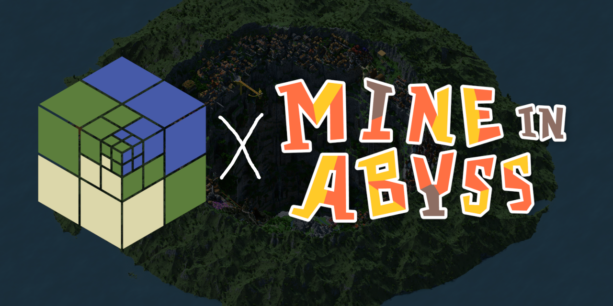

# 
A kawashirov's customized version of **Distant Horizons** mod for **Mine in Abyss** server.
Fixes some server-specific errors and minor optimizations.
 
Check out the mod's main GitLab page here:
https://gitlab.com/jeseibel/minecraft-lod-mod
 
Check out Mine in Abyss here:
https://mineinabyss.com/

### Differences from original version
- Fixed issue that causes `LodDataBuilder` to fail on most of tall chunks on MiA. Should build LODs for all the chunks properly.
- Removed `glIsProgram` check, as it does nothing but slows rendering. Should boost FPS on most machines.
Please note, that all changes made not in this repo, but in core repo:
https://github.com/kawashirov/distant-horizons-core/compare/main...main-kawashirov

### How to migrate
You don't need to do anything special.
 
Just delete `.jar` of original mod version and replace with this one.
You can download it on Releases page or build yourself (check original repo above for instructions).
 
Save file of original version works with this version,
but you need to re-visit parts of the world that was broken,
to re-generate broken LODs.
